# Lab 1: IT Support Agent の実装とデプロイ

Bobを使ってエージェントを実装し、watsonx Orchestrateにデプロイする


---

## このラボについて

このラボでは、IBM Bobを使ってIT Support Agent を実装し、watsonx Orchestrateにデプロイします。

Bobのコード生成機能を活用して、仕様書からエージェントを自動生成し、デプロイまでの一連の流れを体験します。

---

## ハンズオンシナリオ

### ステップ1: サンプルファイルの準備(Planモード)

+ リポジトリ内のサンプル仕様書（`WxO_it_support_draft_agent_spec_jp.md`）をダウンロードし、Bobがアクセスできるフォルダに配置します。

> **💡 ヒント:** Bobは現在のワークスペース内のファイルにアクセスすることができます。アクセスさせたいフォルダを開いていることを確認してください。

+ エージェントとツールの名前を各自固有のものにするために、名前を変更するよう指示します。
```
WxO_it_support_draft_agent_spec_jp.md のエージェントの名前とツールの名前の最後に「_XX」を追加してください。
```
> **⚠️ 注意** 「_XX」はご自身のイニシャルに変えて入力してください。

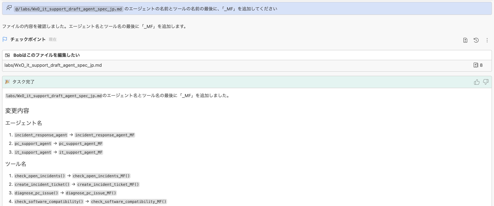
---

### ステップ2: 仕様書の確認と改善（Planモード）

Bobに仕様書を確認させ、必要に応じて改善を提案してもらいます。
`新しいタスクを開始`をクリックし、新しいタスクに切り替えてから以下の指示を入力します。

#### Bobへの指示

```
WxO_it_support_draft_agent_spec_jp.md を確認して、必要があれば改善してください。
```

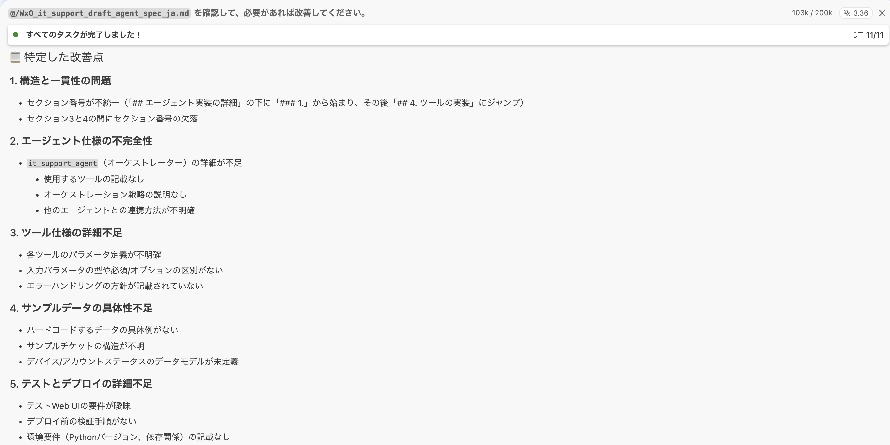

Bobは仕様書を分析し、不明瞭な点や改善が必要な箇所をリストして改善方針を示します。やりとりの中でこちらの確認を求める場合がありますが、希望するものを選んで改善を指示します。

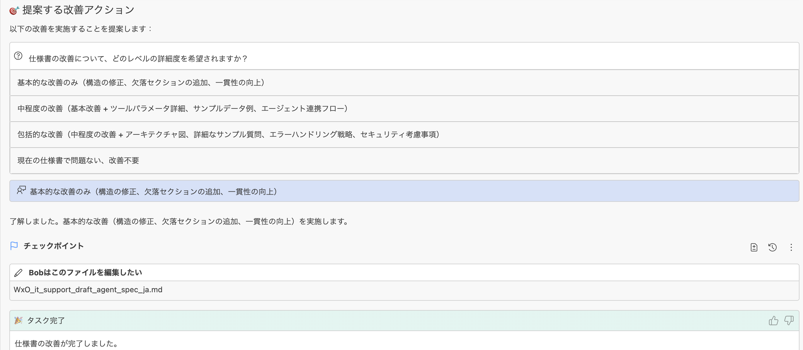

---

### ステップ3: エージェントの実装(Codeモード)

仕様書をもとに、Bobにエージェントシステムを実装させます。

#### Bobへの指示

```
WxO_it_support_draft_agent_spec_jp.md をもとにエージェントシステムを実装し、実装されたプロジェクトは /it-support に配置してください
```

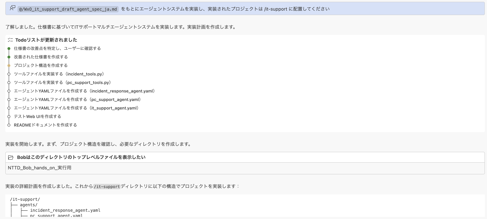

#### Bobの出力例

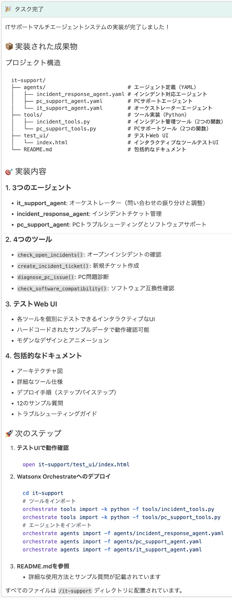

#### 生成されるプロジェクト構造

```
credit-card-agent/
it-support/
├── agents/                          # エージェント定義ファイル
│   ├── incident_response_agent.yaml # インシデント対応エージェント
│   ├── pc_support_agent.yaml        # PCサポートエージェント
│   └── it_support_agent.yaml        # オーケストレーターエージェント
├── tools/                           # ツール実装ファイル
│   ├── incident_tools.py            # インシデント管理ツール
│   └── pc_support_tools.py          # PCサポートツール
├── test_ui/                         # テストWeb UI
│   └── index.html                   # ツールテスト用UIページ
└── README.md
```

> **✅ 成功:** Bobは仕様書に基づいて、必要なエージェント、ツール、設定ファイルを自動生成します。

---

### ステップ4: watsonx Orchestrate環境の有効化

実装したエージェントをwatsonx Orchestrateにデプロイするために、環境を有効化します。

#### 4.1. ターミナルでコマンドを実行

```bash
orchestrate env activate wxo-aws
```

> **⚠️ 注意:** 環境名（`wxo-aws`）は、自身のwatsonx Orchestrate環境に合わせて変更すること。

#### 4.2. API keyの入力

API keyの入力を求められるので入力し、Enterキーを押す。

#### 4.3. 有効化の確認

`[INFO] - Environment 'wxo-aws' is now active` と表示されたら有効化完了です。

---

### ステップ5: エージェントのデプロイ

Bobにエージェントをwatsonx Orchestrateにデプロイするよう指示します。

#### Bobへの指示

```
README.md をもとに、watsonx Orchestrate へエージェントをデプロイしてください
```

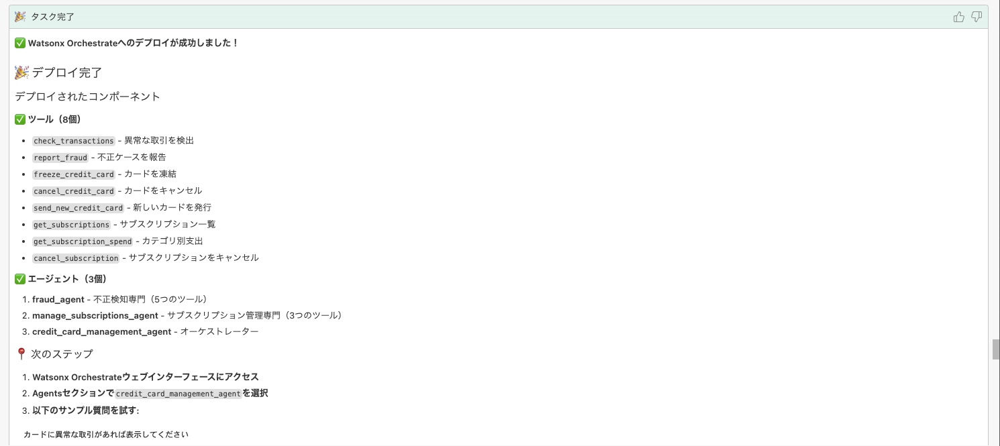

#### デプロイプロセス

Bobは以下の手順を自動的に実行します：

1. README.mdの内容を確認
2. 必要な依存関係をインストール
3. エージェントをビルド
4. watsonx Orchestrateにデプロイ
5. デプロイ結果を確認

> **✅ 成功:** デプロイが成功すると、watsonx Orchestrateのダッシュボードでエージェントが確認できる。

---

### ステップ6: デプロイされたエージェントのテスト

デプロイしたエージェントが正しく動作するかテストします。

#### 6.1. エージェントの選択

+ watsonx OrchestrateのGUIに移動し、①左上のハンバーガーメニューをクリック、②「ビルド」をクリック
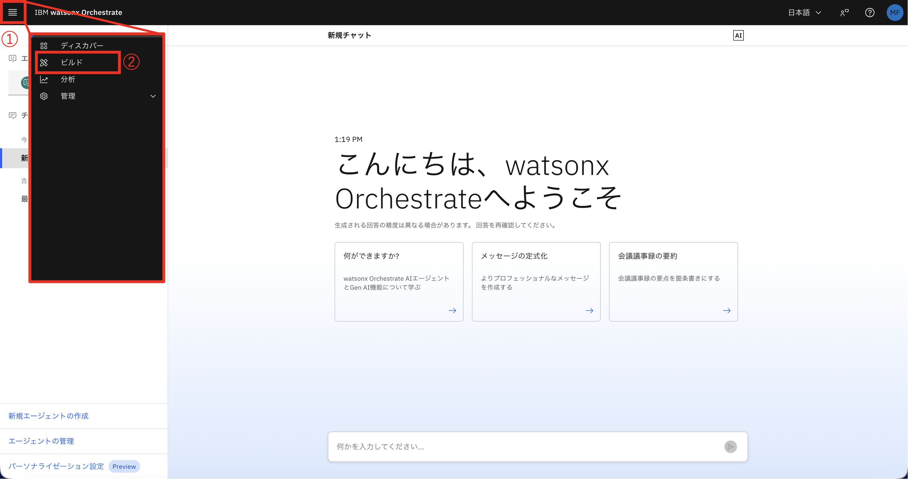

+ 実装したエージェント `it_support_agent` を選択する。
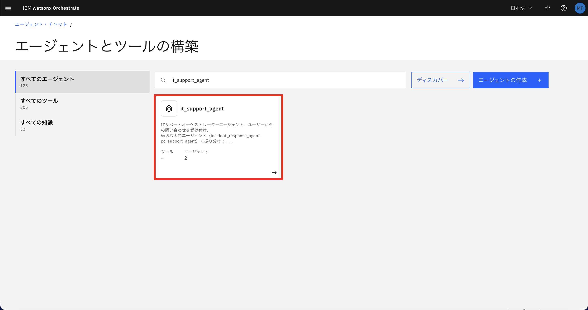

#### 6.2. エージェントの追加(この手順はデプロイの際にエージェントが追加されている場合は不要です)

以下のエージェントを`it_support_agent`に追加します。

- `incident_response_agent`
- `pc_support_agent`

+ 「エージェントの追加」をクリック
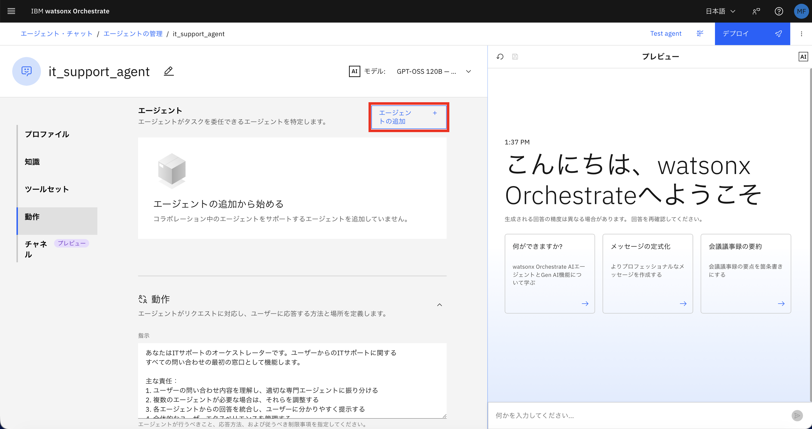

+ 「ローカル・インスタンス」をクリック
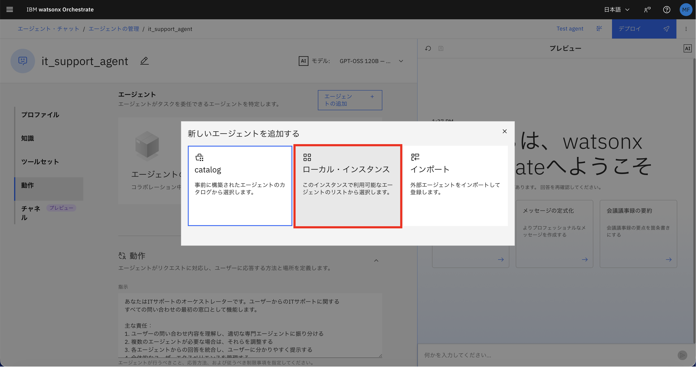

+ ①「incident_response_agent」を検索し、②チェックを入れて、③「エージェントに追加」をクリック
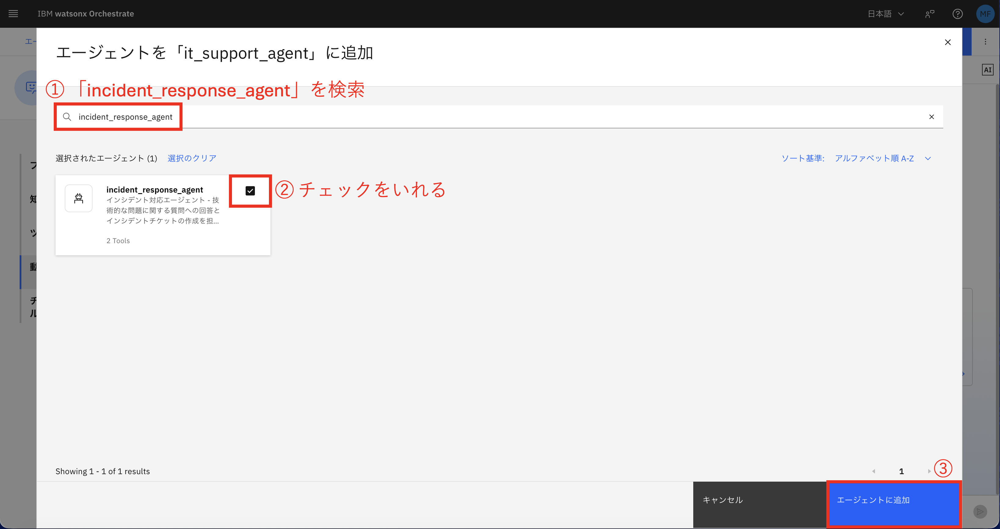

+ 同様に、①「pc_support_agent」を検索し、②チェックを入れて、③「エージェントに追加」をクリック


+ 2つのエージェントが追加されたことを確認
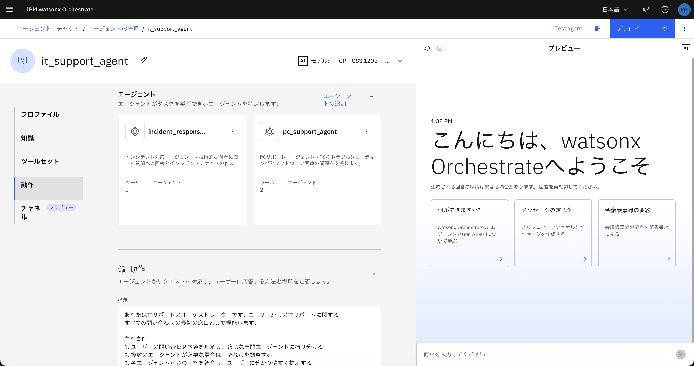

#### 6.3. テストチャットでの動作確認

テストチャットをリフレッシュして、以下のような質問を入力してテストします。

```
例: 
現在のオープンチケットを確認したい
Microsoft Officeをインストールしたい
```

**出力例**

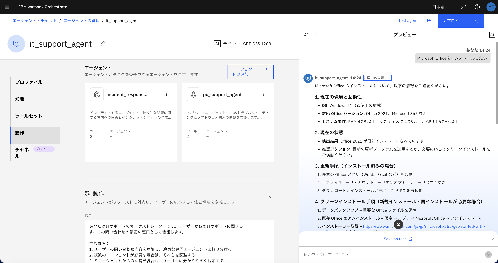

「理由の表示」を開いてみると、適切なエージェントが自動的に選択され、対応するツールが実行されていることがわかります。

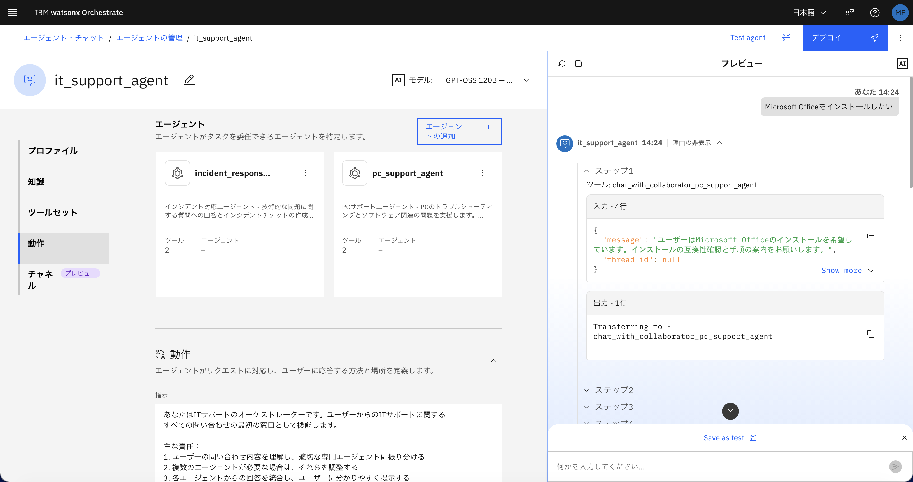

---

## トラブルシューティング

### よくある問題と解決方法

#### 問題1: 環境の有効化に失敗する

**症状:** `orchestrate env active`コマンドでエラーが発生

**解決方法:**

- API keyが正しいか確認
- 環境名が正しいか確認（`orchestrate env list`で確認可能）
- ネットワーク接続を確認

#### 問題2: デプロイに失敗する

**症状:** エージェントのデプロイ時にエラーが発生

**解決方法:**

- 依存関係が正しくインストールされているか確認
- エージェントの設定ファイル（`agent.yaml`）を確認
- Bobに「デプロイエラーのログを確認してください」と指示

#### 問題3: エージェントが応答しない

**症状:** テストチャットでエージェントが応答しない

**解決方法:**

- エージェントが正しくデプロイされているか確認
- 必要なツールが追加されているか確認
- watsonx Orchestrateのログを確認

---

## まとめ

### 達成したこと

このラボでは、以下を実施しました。

- ✅ 仕様書の確認と改善
- ✅ 仕様書の日本語翻訳
- ✅ Bobによるエージェントの自動実装
- ✅ watsonx Orchestrateへのデプロイ
- ✅ エージェントの動作テスト

### 学んだこと

- Bobの強力なコード生成機能
- 仕様書からエージェントへの変換プロセス
- watsonx Orchestrateへのデプロイ方法
- エージェントのテストとデバッグ

### 次のステップ

> **➡️ Lab 2へ進む:** ContentIQでRAG構築

[Lab 2へ](lab2-contentiq.md)

---

© 2026 IBM watsonx Orchestrate ハンズオン教材

[ホームに戻る](../index.md) | [GitHub](https://github.com/your-repo/bob-hands-on)