# Lab 2: ContentIQでRAG構築

watsonx Orchestrate公式ドキュメントを使ったRAG（Retrieval-Augmented Generation）システムを構築する

---

## このラボについて

このラボでは、IBM ContentIQを使用して、ドキュメントやWebサイトをベースにしたRAG（Retrieval-Augmented Generation）システムを構築します。

### 🎯 このラボで実現すること

- ContentIQへのドキュメントインポート
- RAGベースの質問応答システムの構築
- エージェントとの統合

> **ℹ️ RAGとは:** Retrieval-Augmented Generation（検索拡張生成）は、外部のナレッジベースから関連情報を検索し、その情報を使ってより正確な回答を生成する技術です。

---

## 学習目標

このラボでは、以下のスキルを習得する：

- ✅ Webドキュメントのスクレイピングとデータ準備
- ✅ IBM ContentIQの設定とコレクション作成
- ✅ ドキュメントのインポートとインデックス作成
- ✅ RAG検索ツールの実装
- ✅ エージェントへのRAG統合

---

## 演習

例として、watsonx Orchestrateの公式ドキュメントを使用します。

[https://developer.watson-orchestrate.ibm.com/getting_started/installing](https://developer.watson-orchestrate.ibm.com/getting_started/installing)

#### ステップ1: Connectionsからドキュメントを追加する

+ 左のメニューから「Connections」をクリックし、②「View all」をクリック
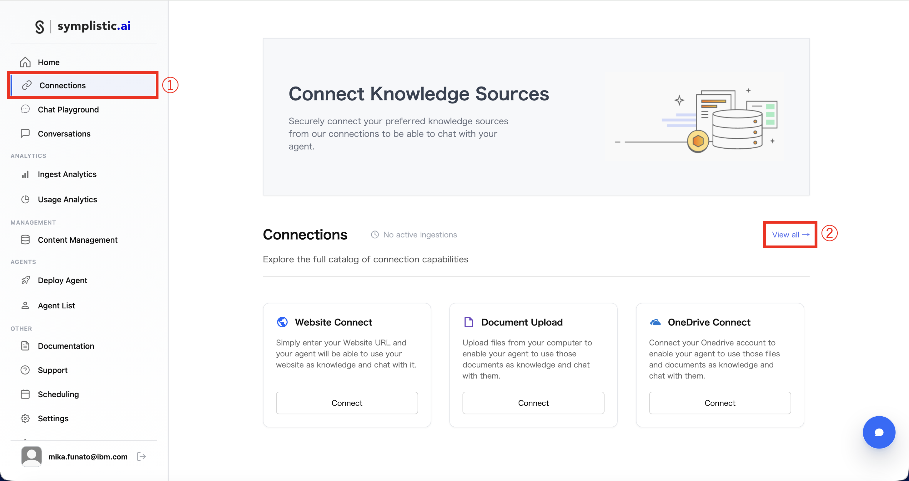

+ ドキュメントのタイプを選択することができます。今回は「Website Connect」を使用します
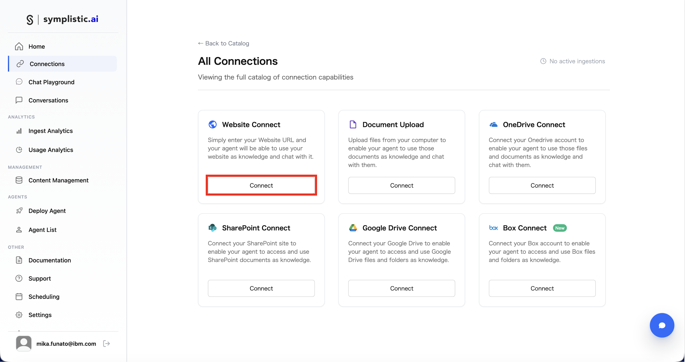

+ ①URLを入力し、②「Continue」をクリック
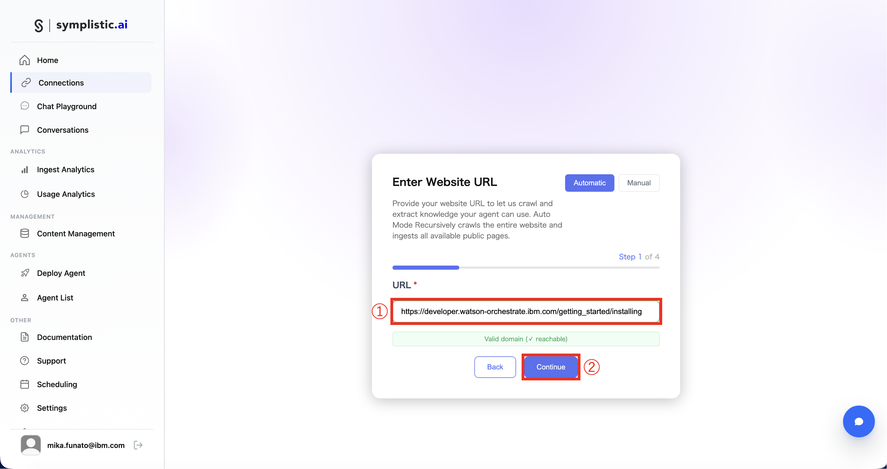

+ 今回は先ほど作成した `it_support_agent_XX` にRAGとして追加するため、①「Use Existing Agent」にチェックを入れ、②「Continue」をクリック.  
※「Create New Agent」から、この画面で新しくエージェントを作ることもできます。
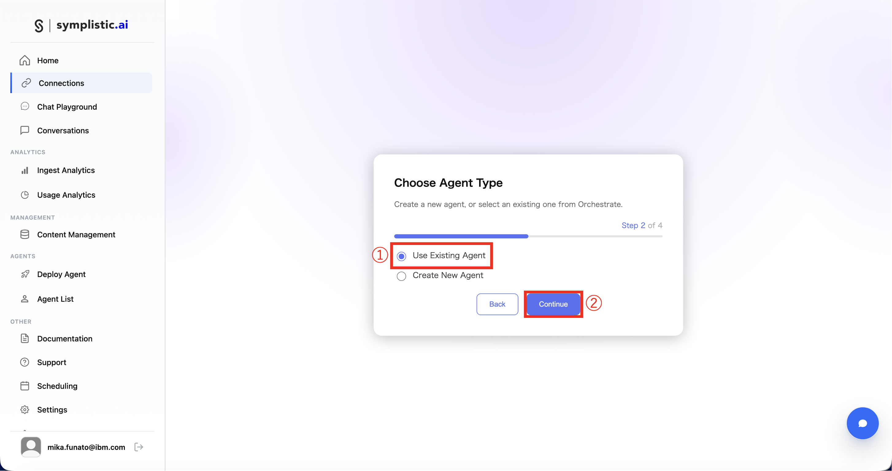

+ ①「it_support_agent_XX」を選択し、②「Continue」をクリック
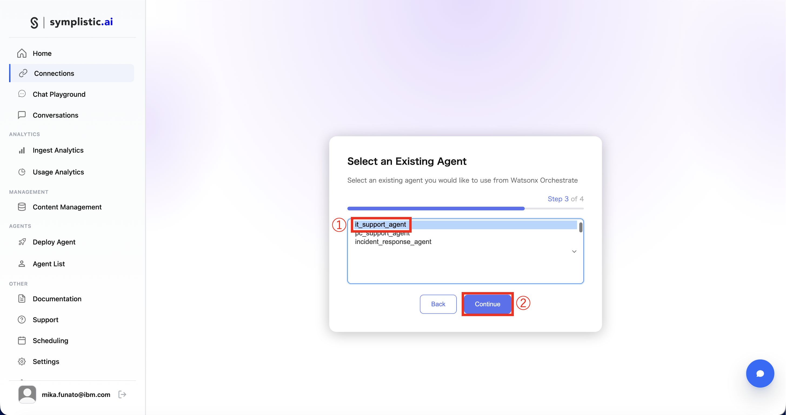

+ 「Finish & Connect」をクリックし、スクレイピング等を実行します
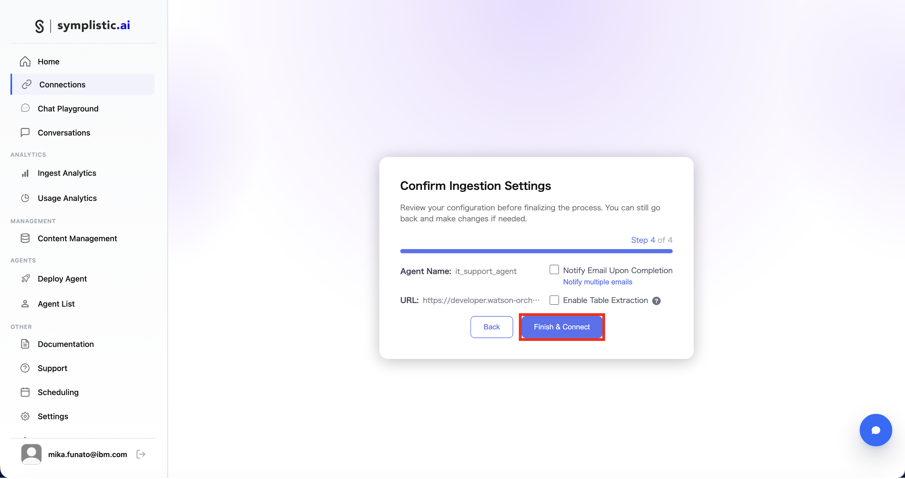

+ 実行中の画面。指定した「installing」で終わるリンクだけでなく、同じ階層にいる「what is」「examples」なども自動でスクレイピングしてくれることがわかります
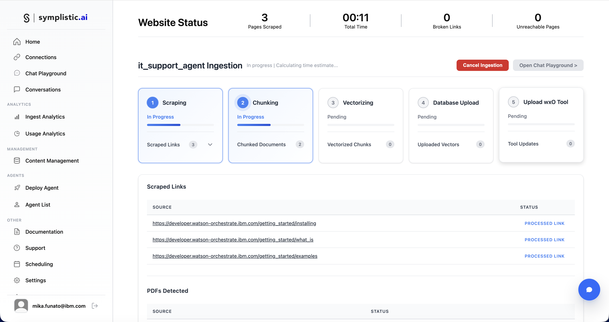

+ ①〜⑤がすべて緑色になったら完了です。「Open Chat Playground」をクリックして作成されたRAG検索ツールを触ってみましょう
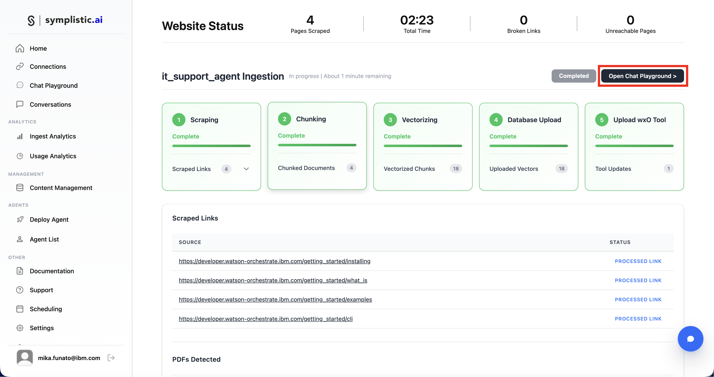

#### ステップ2: RAG検索ツールのテスト ContentIQ編

watsonx OrchestrateのADKのインストールに関する質問をします。

```
例: 
ADKのインストールに必要な、前提条件を教えてください
ADKをアクティブにするためのコマンドを教えてください
```
※日本語で入力して、変換をEnterで確定する際に文章が送信されてしまう場合があるので、メモなどで全文入力したのちにそれをコピペで入力欄に入れることをお勧めします。

**出力例**
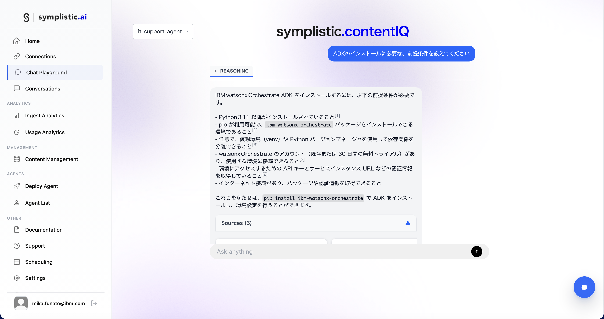

「Sources」を開いてみると、ドキュメントのどの部分を参考に出力をしているかが確認できます。

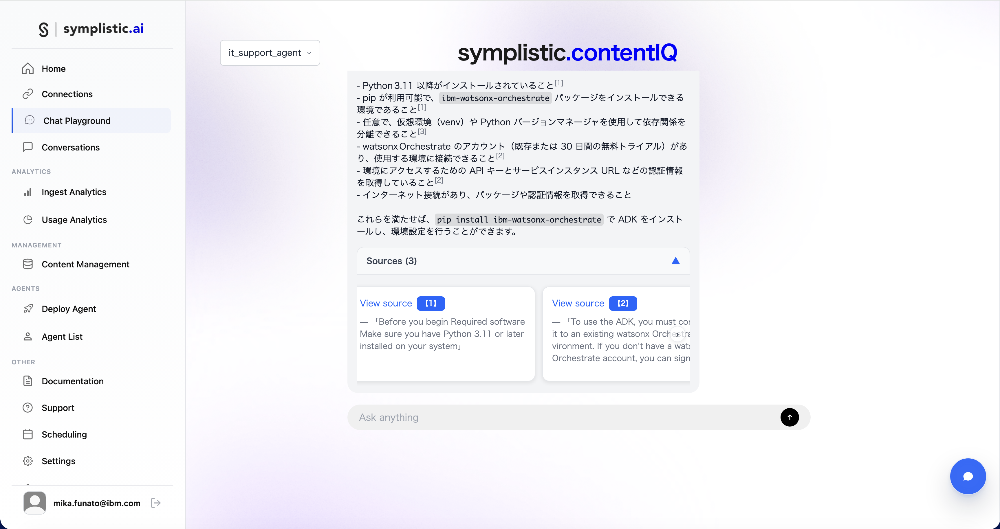

#### ステップ3: RAG検索ツールのテスト watsonx Orchestrate編

+ watsonx Orchestrateで `it_support_agent_XX` のビルド画面を開きます(左上のハンバーガーメニュー → Build → `it_support_agent_XX`)

+ `Toolset` に `symplisticai_tool_it_support_agent_XX_ご自身のメールアドレス` が作成されていることを確認します

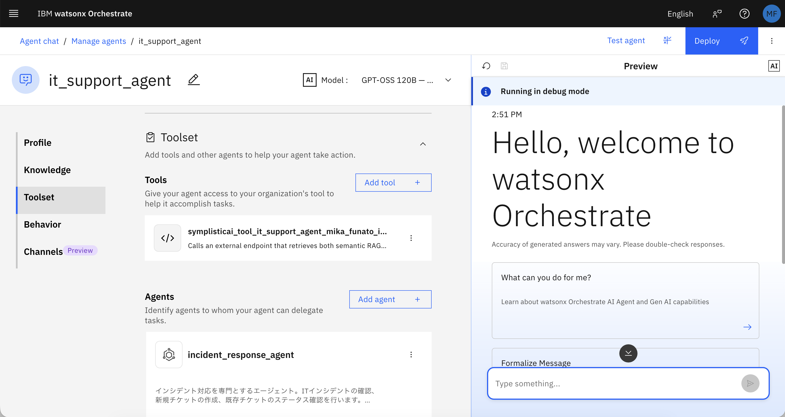

+ `Behavior` にContentIQに関する記述を追加します
```
例: 

## 利用可能なコラボレーター
**symplisticai_tool_it_support_agent_mika_funato_ibm_com**: watsonx Orchestrate ADKのドキュメントを格納したRAG
   - 用途: watsonx Orchestrate ADKに関する質問への回答
   - 対応範囲: watsonx Orchestrate ADK
```
※最初に作成したエージェントの設定によって、Behaviorの記述が異なります。ご自身のエージェントに合わせた記述に修正いただく必要がある場合があります。

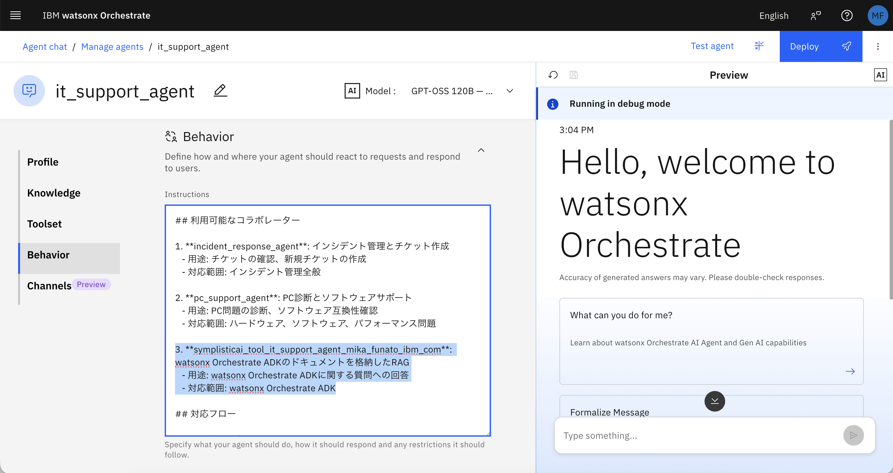

+ モデルが `GPT-OSS 120B - OpenAI(via Groq)`になっていることを確認し、チャットをリフレッシュします

+ watsonx OrchestrateのADKのインストールに関する質問をします。
```
例: 
ADKのインストールに必要な、前提条件を教えてください
ADKをアクティブにするためのコマンドを教えてください
```

+ `Show Reasoning` をクリックします

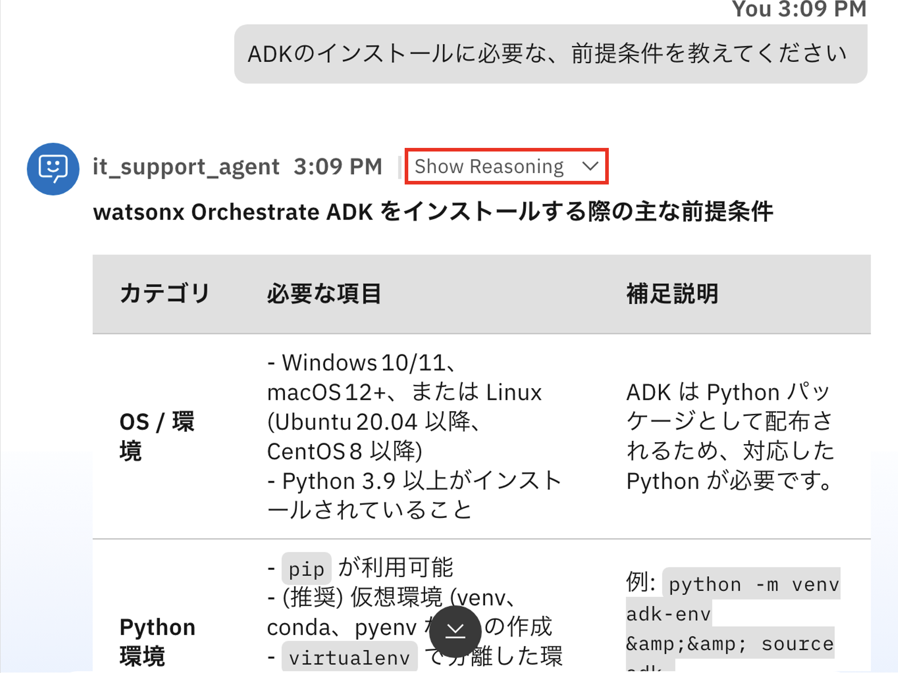

+ `Step1`をクリックすると回答の根拠を確認することができます。`symplisticai_tool_it_support_agent_mika_funato_ibm_com`を使用して回答していることがわかります

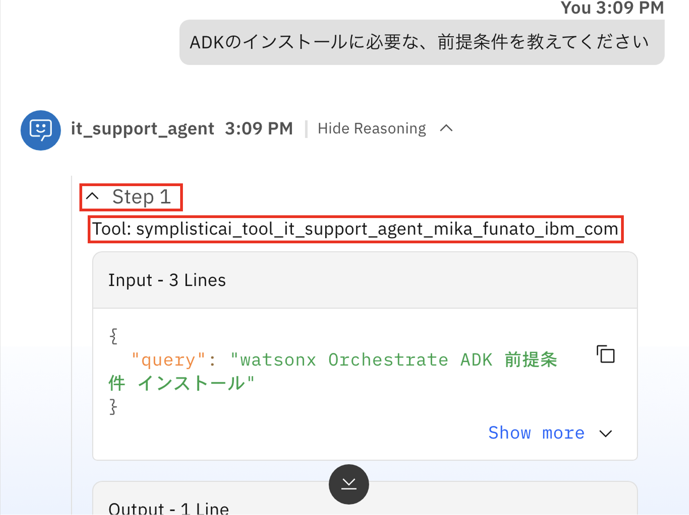


---

## トラブルシューティング

### よくある問題と解決方法

#### 問題1: ContentIQに接続できない

**症状:** API呼び出しでエラーが発生

**解決方法:**

- 環境変数が正しく設定されているか確認
- APIキーが有効か確認

---

## まとめ

### 達成したこと

このラボでは、以下を実装した：

- ✅ watsonx Orchestrate公式ドキュメントのスクレイピング
- ✅ ContentIQへのドキュメントインポート
- ✅ RAG検索ツールの実装
- ✅ RAGベースの質問応答エージェント
- ✅ 出典を明記した正確な回答生成

### 学んだこと

- RAG（Retrieval-Augmented Generation）の基本概念
- ContentIQを使ったナレッジベース構築
- 検索結果の最適化とスコアリング
- エージェントへのRAG統合パターン

### 応用例

このRAGシステムは、以下のような用途に応用できる：

- 社内ドキュメントの質問応答システム
- 製品マニュアルのチャットボット
- 技術サポートの自動化
- ナレッジベース検索の強化

---

© 2026 IBM watsonx Orchestrate ハンズオン教材

[ホームに戻る](../README.md) | [GitHub](https://github.com/your-repo/bob-hands-on)