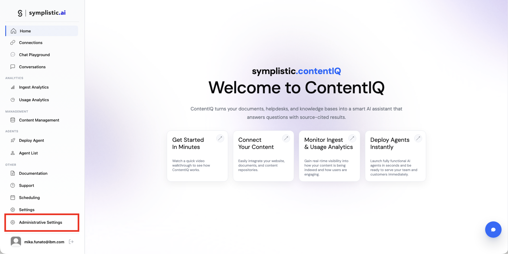
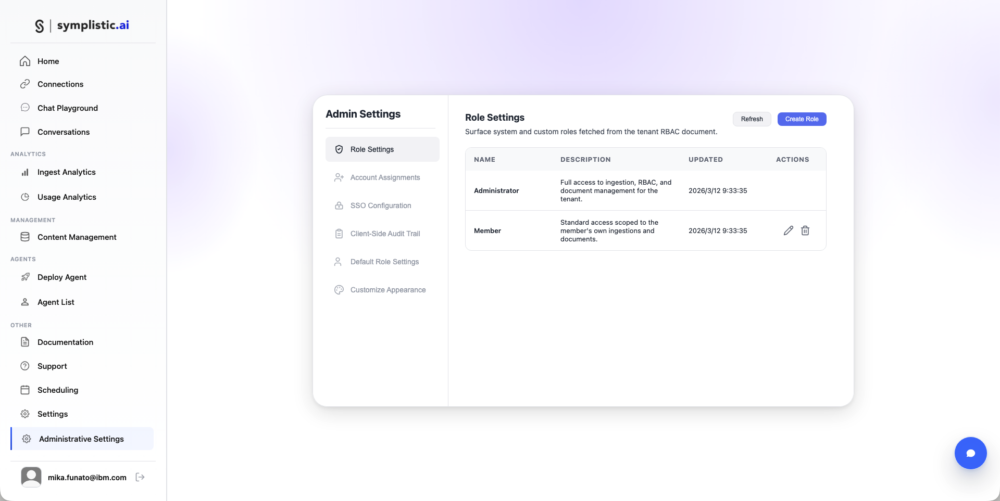
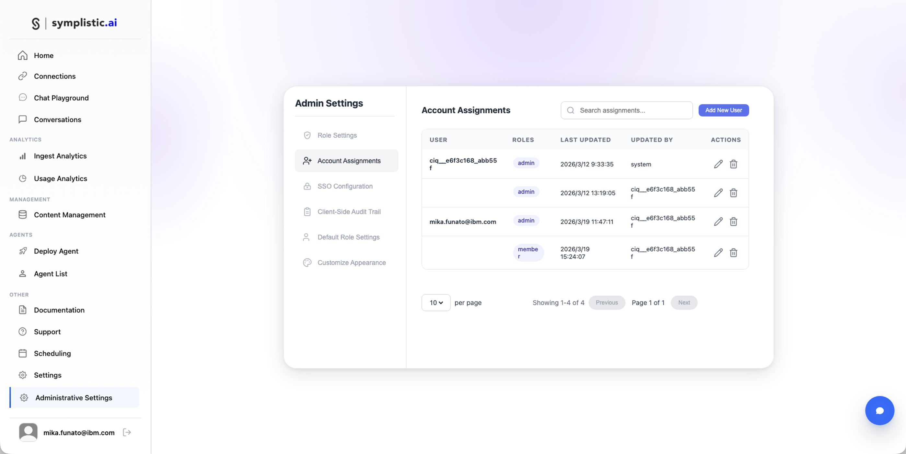
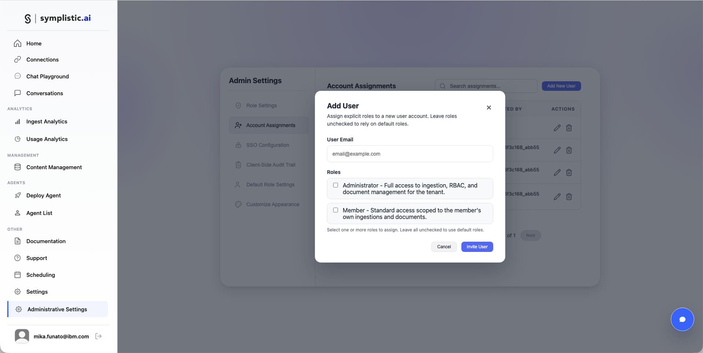
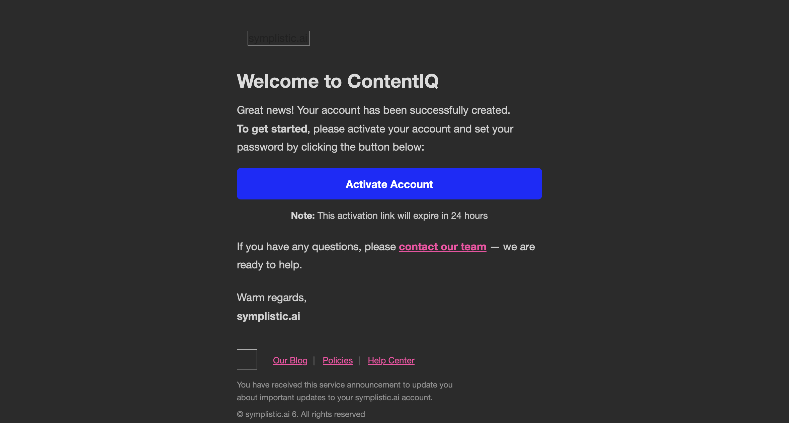

# ContentIQセットアップガイド

ナレッジベース構築を行います。

---

## 📋 目次

- [ContentIQとは](#contentiqとは)
- [ContentIQの起動確認](#contentiqの起動確認)
- [管理者による設定](#管理者による設定)
- [セットアップ完了](#セットアップ完了)

---

## ContentIQとは

ContentIQは、symplistick.aiが提供する、RAG構築ソリューションです。

### 主な機能

- ✅ 自然言語による高度な検索
- ✅ ドキュメント理解とエンティティ抽出
- ✅ パッセージ検索とランキング
- ✅ 多言語サポート

---

## ContentIQの起動確認

### 手順

1. ContentIQにアクセスします
   
   **URL:** [https://contentiq.symplistic.ai](https://contentiq.symplistic.ai)

2. 初めてログインする場合は、watsonx Orchestrateの認証情報(APIキーとURL)の入力を求められるので、控えたものを入力します

3. ContentIQのホーム画面が表示されたら、ログインが完了です

---

## 管理者による設定

### 手順

1. ContentIQのHomeから、「Administrative Setting」をクリックします

   

2. 「Role Setting」では「Administrator」や「Member」など権限のレベルを設定できます

   

3. 「Account Assignments」ではメンバーの追加や削除ができます。新規追加をするには、「Add New User」をクリックします

   

4. メールアドレスを入力し、適切なRoleを割り当てて「invite User」をクリックします

   

5. 追加したメンバーにはメールが届きます。24時間以内にActivateする必要があります

   

---

## セットアップ完了

### 🎉 おめでとうございます！

すべての環境構築が完了しました。

### セットアップした環境

- ✅ IBM Bob - AI開発アシスタント
- ✅ watsonx Orchestrate - AIエージェントプラットフォーム
- ✅ MCP統合 - BobとOrchestrateの連携
- ✅ ContentIQ - RAGシステム構築基盤

### 💡 次のステップ

これで、IBM BobとwatsonX Orchestrateを使ったAIエージェント開発の準備が整いました。実際のエージェント開発を始めることができます。

---

**ナビゲーション:**
- [← MCPセットアップ](mcp-setup.md)
- [← README に戻る](../README.md)

---

© 2026 IBM watsonx Orchestrate セットアップガイド