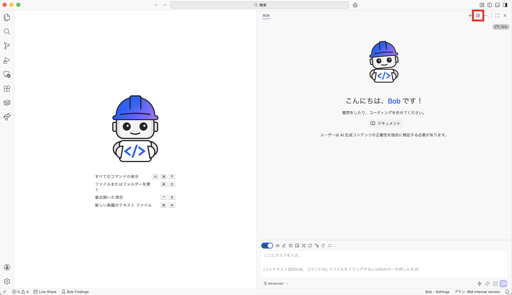
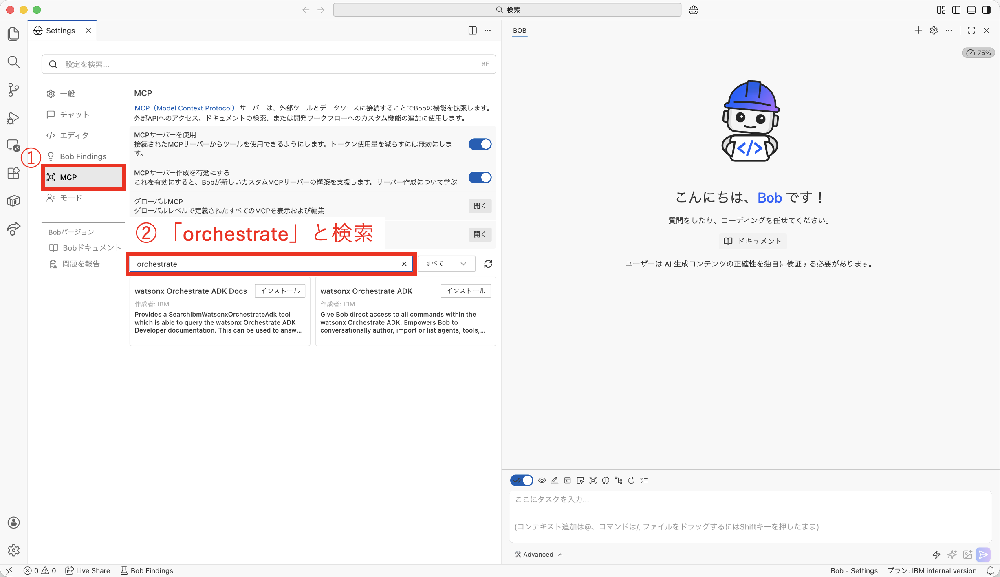
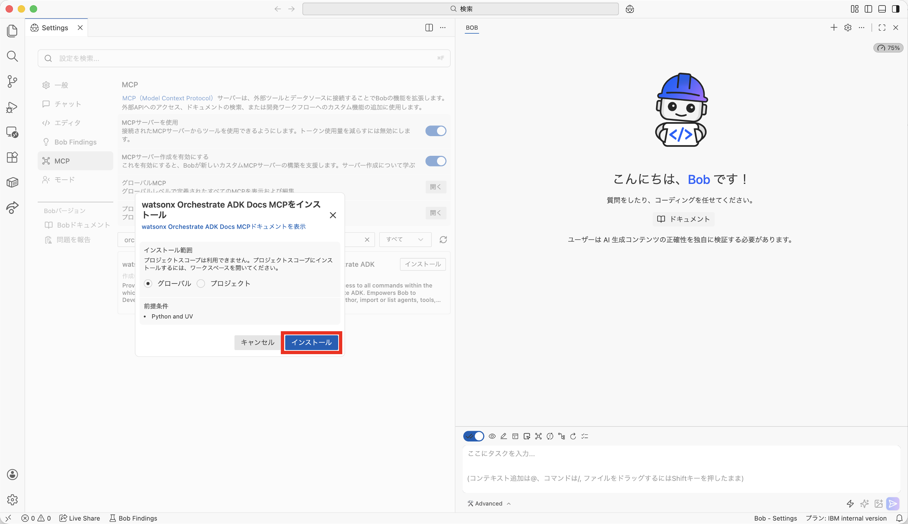
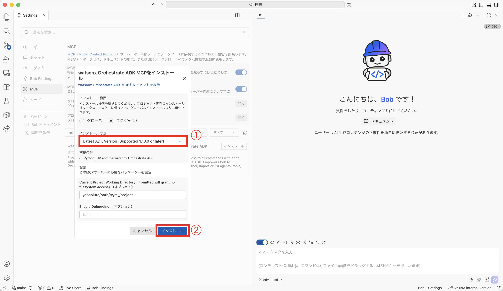

# MCP統合セットアップガイド

BobでMCPツールを管理する方法を説明します。

---

## 📋 目次

- [MCPとは](#mcpとは)
- [個別のMCPツールを有効または無効にする](#個別のmcpツールを有効または無効にする)
- [次のステップ](#次のステップ)
- [参考リンク](#参考リンク)

---

## MCPとは

Model Context Protocol (MCP)は、AIモデルと外部ツール・システムを標準化された方法で接続するためのオープンプロトコルです。IBM BobはMCPをサポートしており、watsonx Orchestrateとシームレスに統合できます。

> 💡 **詳細情報:** MCPの詳細については、[公式ドキュメント](https://bob.ibm.com/docs/ide/configuration/mcp/mcp-in-bob)を参照してください。

---

## 個別のMCPツールを有効または無効にする

BobでMCPサーバーを設定すると、そのサーバーが提供するすべてのツールがデフォルトで有効になります。

### 手順

1. Bobを起動して、右上の設定を開きます

   

2. ①「MCP」をクリック、②検索窓で「orchestrate」と検索して出てくる2つのMCPを接続します

   

3. 「watsonx Orchestrate ADK Docs MCP」をインストールします

   

4. 「watsonx Orchestrate ADK MCP」をインストールします。「インストール方法」で「Latest ADK Version」を選び、インストールします

   

---

## 次のステップ

MCP設定が完了しました。次は、ContentIQをセットアップします。

➡️ **[ContentIQセットアップガイド](contentiq-setup.md)**

---

## 参考リンク

- [Bob公式ドキュメント - MCP in Bob](https://bob.ibm.com/docs/ide/configuration/mcp/mcp-in-bob)
- [個別のMCPツールを有効または無効にする](https://bob.ibm.com/docs/ide/configuration/mcp/mcp-in-bob#%E5%80%8B%E5%88%A5%E3%81%AEmcp%E3%83%84%E3%83%BC%E3%83%AB%E3%82%92%E6%9C%89%E5%8A%B9%E3%81%BE%E3%81%9F%E3%81%AF%E7%84%A1%E5%8A%B9%E3%81%AB%E3%81%99%E3%82%8B)
- [Model Context Protocol 公式サイト](https://modelcontextprotocol.io/)

---

**ナビゲーション:**
- [← watsonx Orchestrateセットアップ](orchestrate-setup.md)
- [← README に戻る](../README.md)
- [ContentIQセットアップ →](contentiq-setup.md)

---

© 2026 IBM watsonx Orchestrate セットアップガイド