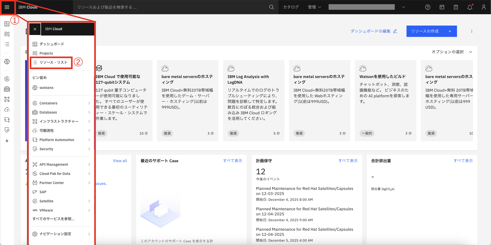
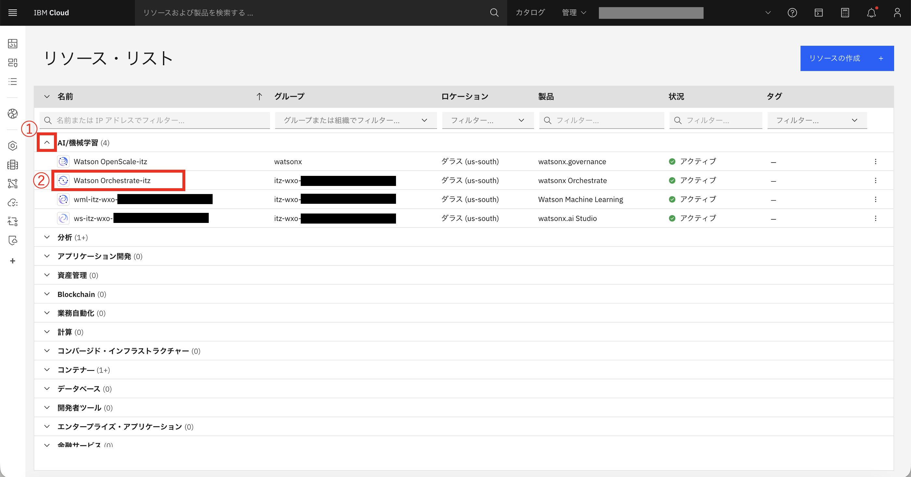
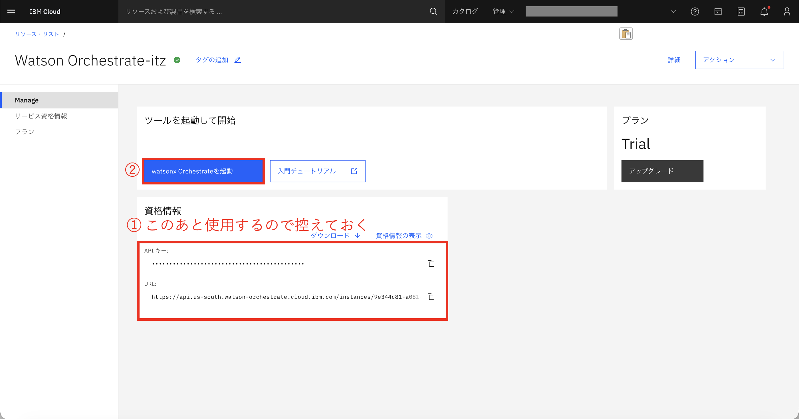
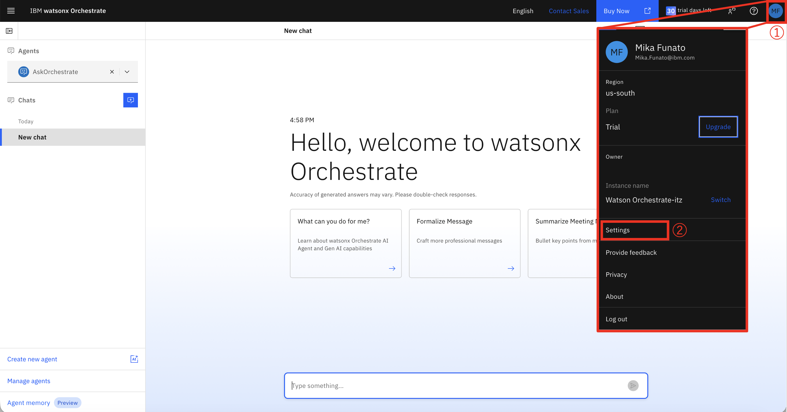
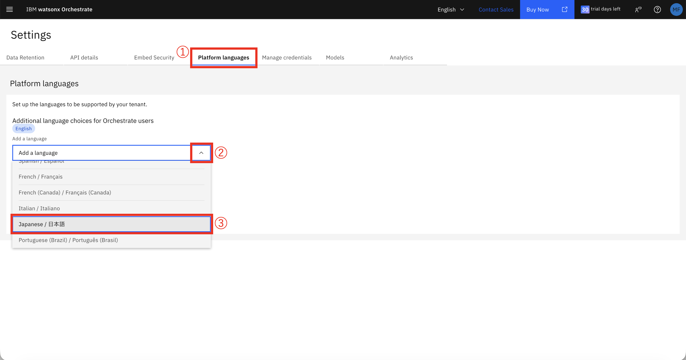
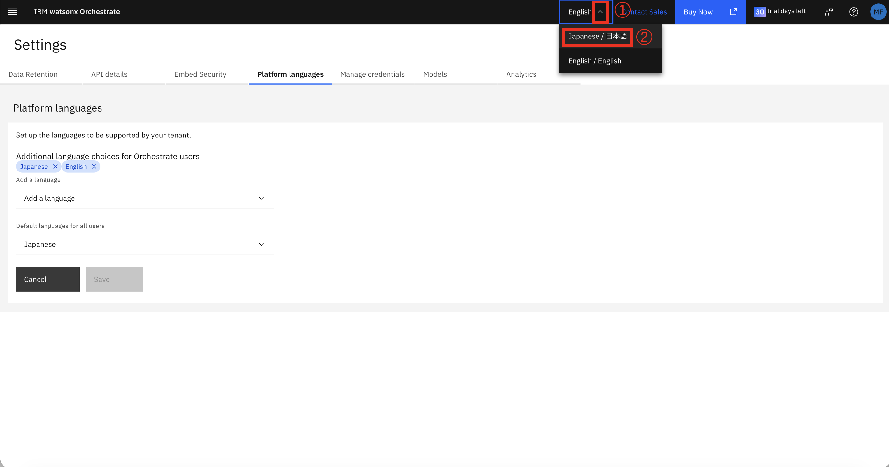
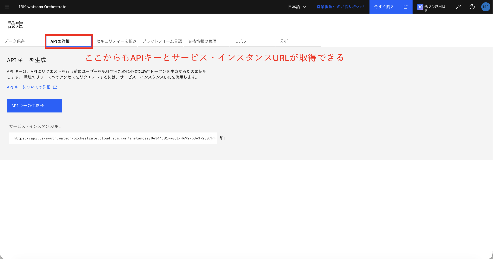

# watsonx Orchestrateセットアップガイド

AIオーケストレーションプラットフォームの環境構築を行います。

---

## 📋 目次

- [watsonx Orchestrateとは](#watsonx-orchestrateとは)
- [IBM Cloudアカウントの作成](#ibm-cloudアカウントの作成)
- [watsonx Orchestrateの起動確認](#watsonx-orchestrateの起動確認)
- [watsonx Orchestrate ADKのセットアップ](#watsonx-orchestrate-adkのセットアップ)
- [次のステップ](#次のステップ)

---

## watsonx Orchestrateとは

watsonx Orchestrateは、IBMが提供するAIオーケストレーションプラットフォームで、複数のAIエージェント、ツール、ワークフローを統合して、複雑なビジネスプロセスを自動化します。

### 主な機能

- ✅ マルチエージェントオーケストレーション
- ✅ ノーコード/ローコードでのワークフロー構築
- ✅ 外部システムとの統合（API、データベース等）
- ✅ エンタープライズグレードのセキュリティとガバナンス
- ✅ リアルタイムモニタリングと分析

---

## IBM Cloudアカウントの作成

> **注意:** IBM idとは異なります

### ステップ1: IBM Cloudへの登録

1. [IBM Cloud登録ページ](https://cloud.ibm.com/registration)にアクセス
2. メールアドレスを入力して「次へ」をクリックします
3. IBM idがある場合は、そのままログインできます
4. 確認メールが送信されます

### ステップ2: アカウントの確認とログイン

1. [IBM Cloudコンソール](https://cloud.ibm.com/login)にログインします
2. ダッシュボードが表示されることを確認します
3. 右上のアカウント名をクリックして、アカウント情報に間違いがないか確認します

---

## watsonx Orchestrateの起動確認

### 手順

1. IBM Cloudにアクセスします
2. ①ハンバーガーメニューから②「リソースリスト」をクリックします

   

3. ①「AI/機械学習」のプルダウンをクリック、②「watsonx Orchestrate」をクリックします

   

4. ①資格情報の「APIキー」と「URL」を控え、②「watsonx Orchestrateを起動」をクリックします

   

5. watsonx Orchestrateが起動します。画面の言語を日本語に変えるために、①右上のプロフィールから、②「Setting」をクリックします

   

6. ①「Platform Language」をクリック、②「Add language」のプルダウンをクリックし、③「日本語」をクリックします

   

7. Saveし、①「English」のプルダウンをクリック、日本語をクリックしてApplyしたら完了です

   

8. 「APIの詳細」からも資格情報を取得することができます

   

---

## watsonx Orchestrate ADKのセットアップ

watsonx Orchestrate ADK（Agent Development Kit）は、エージェントを開発するためのツールキットです。

### 📚 ADKセットアップガイド

**URL:** [https://developer.watson-orchestrate.ibm.com/getting_started/installing](https://developer.watson-orchestrate.ibm.com/getting_started/installing)

このガイドの **「Setting up and installing the ADK」** まで実行します。ガイドには以下の内容が詳しく説明されています：

- システム要件と前提条件
- ADKのインストール手順
- 環境変数の設定
- 認証情報の設定
- 動作確認とトラブルシューティング

### ⚠️ 重要なポイント

**注意事項：**
- ADKのインストールには、watsonx Orchestrateの有効なアカウントが必要です
- APIキーは前のセクションで取得したものを使用してください

---

## 次のステップ

watsonx Orchestrateのセットアップが完了しました。次は、MCPを使ってBobと統合します。

➡️ **[MCP統合セットアップへ](mcp-setup.md)**

---

**ナビゲーション:**
- [← IBM Bobセットアップ](bob-setup.md)
- [← README に戻る](../README.md)
- [MCP統合セットアップ →](mcp-setup.md)

---

© 2026 IBM watsonx Orchestrate セットアップガイド